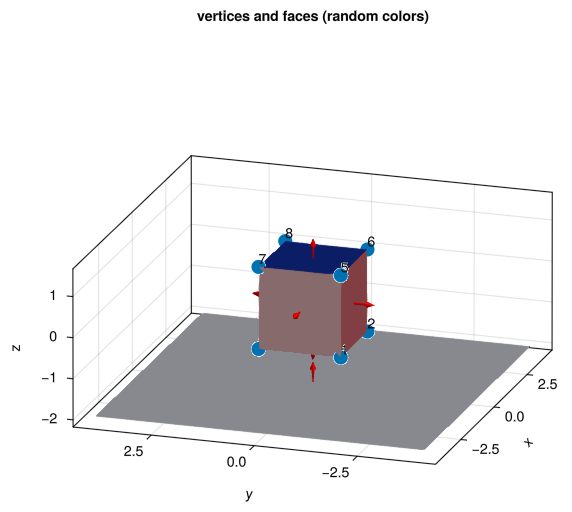
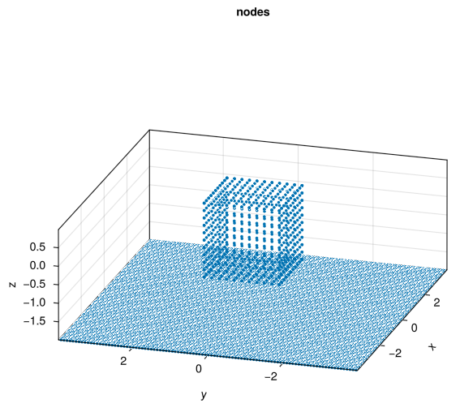
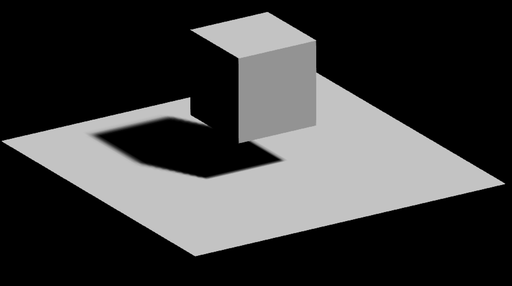
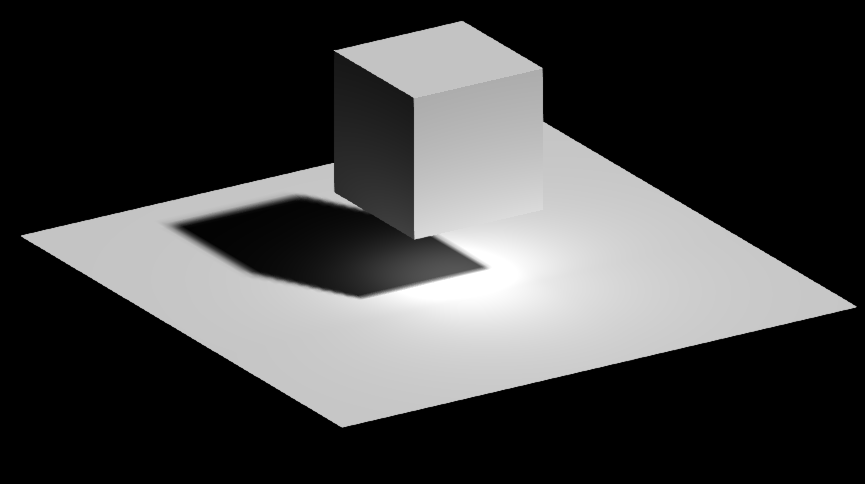

# radiosity-cuboid

A simple exploration of the solution and display of the radiosity boundary integral equation (BIE) on a set of planar faces in 3D. Implemented in Julia, with GLMakie for interactive display.

Author: Alex Barnett, 2/3/26

### The set-up

The seven faces are built from a list of 12 vertices. Four define the ground face, and the the other 8 the cube corners:

Each face is discretized with a square grid of nodes. Since the ground plane needs to discretize a shadow with a somewhat sharp edge, its node spacing h is made smaller than that on the cube's faces.
There are $N=10927$ nodes in total, giving the number of unknowns in the
Nystr\"om discretization of the BIE:

They are given weights from the Cartesian product of the 1D composite
trapezoid rule, giving $O(h^2)$ accuracy for smooth functions.

We use a set of parallel incident light beams to define the direct
illumination of all surfaces. For the ground face only, shadowing
due to the other faces is computed using planar-polygon line intersections in
3D (which uses projection to the plane followed by 2D inside-polygon checking
using the winding number).

### Result

The direct illumination is as follows (notice the flat intensities on each non-ground face, and the completely dark shadows):

The radiosity solution is then, using either a few terms of the Neumann series, or a few CG iterations to get 3-digit accuracy:

Notice the graded diffuse intensities showing multiple scattering,
and realistically graded shadows.

### To-do list

* add pointers to the formulae

* add rho reflectance function, constant per face

* animate light source angle and rotate the cube

* do RGB color channels and render together

* make better Gaussian distributed incident light source using planar uniform light quadrature

* verify $O(h)$ convergence for single light, $O(h^2)$ with smooth distributed light (smoothed shadow)

* study bottleneck in ``directillum`` (shadow code)

* demo edge singularity when cube touches the plane (omit bottom face)
